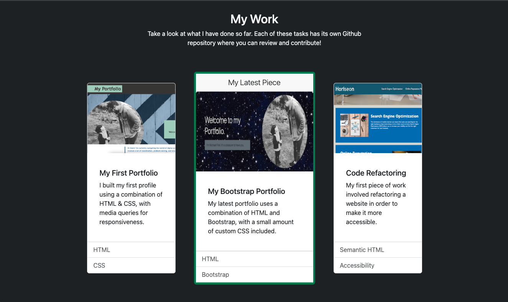
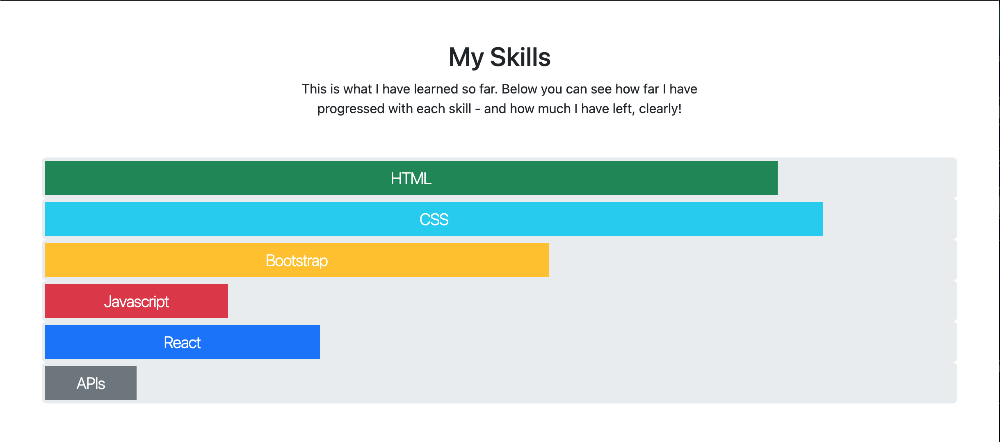
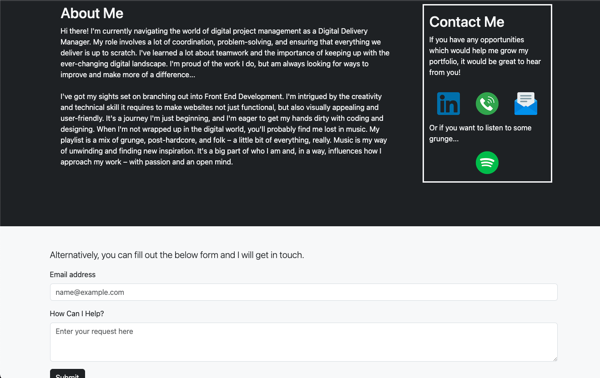

# Bootstrap Portfolio

## Description

This webpage is intended to be an altered version of my [previous portfolio](https://michaelfriel.github.io/My-portfolio/), in order to build the page using Bootstrap rather than through raw HTML / CSS.
Key differences and considerations can be found below: 

* General theme of the page is much darker, with a focus on black and white as the primary palette. 
* Used Bootstrap Navbar component to create the navigation. This responds into a burger menu on medium screens and below.
* Header uses utility classes rather than a Jumbotron, as this component is no longer available in Bootstrap 5.
  * Unlike the original portfolio, the profile image stacks and stays present on smaller screens.
* The structure of the rest of the page differs from the previous portfolio, with the two column orientation dropped in favour of a more conventional component stack.
* My Work uses a Bootstrap grid, with the latest piece of work highlighted in the centre. When there are more pieces, this may be turned into a carousel.
* I have added a 'My Skills' chart, which gives a rough indication of what skills I have developed and how far through each discipline I am. This is certainly indicative rather than an accurate measurement, but provides a useful and engaging visual.
* This is followed by an About Me and Contact section, which uses a Bootstrap grid as dictated in the brief.
  * I have also included a form in this section. This currently doesn't have a destination, but it is in place for use later down the line. It was also a way to include a 'button' on the page in order to showcase box-shadow.
* Finally, this has ended with a new Footer, which contains a small navigation and showcases hover behaviour as requested in the brief.

_This screenshot shows the new work section, which is full width and contains three Bootstrap cards._

_This screenshot shows the My Skills section, which uses Bootstrap custom progress bars._

_This screenshot shows the new About Us and Contact section, which uses Bootstraps grid format and is followed by a form component._

## Installation

To review the portfolio, please follow this URL: https://michaelfriel.github.io/bootstrap-portfolio/

The code is available to be cloned from the Bootstrap-Portfolio repository, using gut commands. To access this, please follow this URL: https://github.com/MichaelFriel/bootstrap-portfolio

## Usage

The usage is very typical of an ordinary webpagem with some nuances below:

* Navigation and Footer can both be used to navigate through the page.
* Breakpoints occur for small, medium, large and extra-large screens.
* **Form function is currently not connected, but is used to showcase Bootstrap componentry and will be hooked up later down the line.**

## Credits

<a href="https://www.flaticon.com/free-icons/linkedin" title="linkedin icons">Linkedin icons created by Freepik - Flaticon</a>

  <a href="https://www.flaticon.com/free-icons/telephone" title="telephone icons">Telephone icons created by lakonicon - Flaticon</a>

  <a href="https://www.flaticon.com/free-icons/email" title="email icons">Email icons created by Pixel perfect - Flaticon</a>

  <a href="https://www.flaticon.com/free-icons/spotify-sketch" title="spotify sketch icons">Spotify sketch icons created by Fathema Khanom - Flaticon</a>

## License

Please see Mit License contained within repository.

